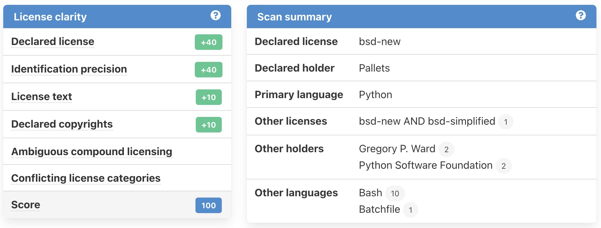

.. _faq:

FAQs
====

You can't find what you're looking for? Below you'll find answers to a few of
our frequently asked questions.

How can I run a scan?
---------------------

Once you've completed the ScanCode.io app installation,
you simply start by creating a :ref:`new project <user_interface_create_new_project>`
and run the appropriate pipeline.

ScanCode.io offers several :ref:`built_in_pipelines` depending on your input, see
the :ref:`faq_which_pipeline` bellow.

As an alternative, I you simply which to run a pipeline without installing ScanCode.io
you may use the Docker image to run pipelines as a single command:

.. code-block:: bash

  docker run --rm \
    -v "$(pwd)":/codedrop \
    ghcr.io/nexb/scancode.io:latest \
    sh -c "run scan_codebase /codedrop" \
    > results.json

Refer to the :ref:`cli_run` section for more about this approach.

.. _faq_which_pipeline:

Which pipeline should I use?
----------------------------

Selecting the right pipeline for your needs depends primarily on the type of input
data you have available.
Here are some general guidelines based on different input scenarios:

- If you have a **Docker image** as input, use the
  :ref:`analyze_docker_image <pipeline_analyze_docker_image>` pipeline.
- For a full **codebase compressed as an archive**, optionally also with
  it's **pre-resolved dependenices**, and want to detect all the packages
  present linked with their respective files, use the
  :ref:`scan_codebase <pipeline_scan_codebase>` pipeline.
- If you have a **single package archive**, and you want to get information
  on licenses, copyrights and package metadata for it, opt for the
  :ref:`scan_single_package <pipeline_scan_single_package>` pipeline.
- When dealing with a **Linux root filesystem** (rootfs), the
  :ref:`analyze_root_filesystem_or_vm_image <pipeline_analyze_root_filesystem>` pipeline
  is the appropriate choice.
- For processing the results of a **ScanCode-toolkit scan** or **ScanCode.io scan**,
  use the :ref:`load_inventory <pipeline_load_inventory>` pipeline.
- When you want to import **SPDX/CycloneDX SBOMs or ABOUT files** into a project,
  use the :ref:`load_sbom <pipeline_load_sbom>` pipeline.
- When you have **lockfiles or other package manifests** in a codebase and you want to
  resolve packages from their package requirements, use the
  :ref:`resolve_dependencies <pipeline_resolve_dependencies>` pipeline.
- When you have application **package archives/codebases** and optionally also
  their **pre-resolved dependenices** and you want to **inspect packages**
  present in the package manifests and dependency, use the
  :ref:`inspect_packages <pipeline_inspect_packages>` pipeline.
- For scenarios involving both a **development and deployment codebase**, consider using
  the :ref:`map_deploy_to_develop <pipeline_map_deploy_to_develop>` pipeline.
- For getting the DWARF debug symbol compilation unit paths when available from an elf binary.
  use the :ref:`inspect_elf_binaries <pipeline_inspect_elf>` pipeline.

These pipelines will automatically execute the necessary steps to scan and create the
packages, dependencies, and resources for your project based on the input data provided.

After executing one of the pipelines mentioned above, you have the option to
**augment your project's data** by executing additional pipelines, often referred to
as **addon** pipelines.
These additional pipelines offer further enhancements and modifications to your
existing data, allowing for more comprehensive analysis and insights.

- If you wish to **find vulnerabilities** for packages and dependencies, you can use the
  :ref:`find_vulnerabilities <pipeline_find_vulnerabilities>` pipeline.
  Note that setting up :ref:`VulnerableCode <scancodeio_settings_vulnerablecode>` is
  required for this pipeline to function properly.

- To **populate PurlDB with the packages discovered in your project**,
  use the :ref:`populate_purldb <pipeline_populate_purldb>` pipeline.
  Before executing this pipeline, make sure to set up
  :ref:`PurlDB <scancodeio_settings_purldb>`.

- To **match your project codebase resources to MatchCode.io for Package matches**,
  utilize the :ref:`match_to_matchcode <pipeline_match_to_matchcode>` pipeline.
  It's essential to set up :ref:`MatchCode.io <scancodeio_settings_matchcodeio>` before
  executing this pipeline.

What is the difference between scan_codebase and scan_single_package pipelines?
-------------------------------------------------------------------------------

The key differences are that the
:ref:`scan_single_package <pipeline_scan_single_package>` pipeline
treats the input as if it were a single package, such as a package archive, and
computes a **License clarity** and a **Scan summary** to aggregate the package scan
data:

In contrast, the :ref:`scan_codebase <pipeline_scan_codebase>` pipeline is more of a
general purpose pipeline and make no such single package assumption.
It does not not compute such summary.

You can also have a look at the different steps for each pipeline from the
:ref:`built_in_pipelines` documentation.

Can I run multiple pipelines in parallel?
-----------------------------------------

Yes, you can run multiple pipelines in parallel by starting your Docker containers
with the desired number of workers using the following command::

    docker compose up --scale worker=2

.. note:: You can also add extra workers by running the command while the ScanCode.io
   services are already running. For example, to add 2 extra workers to the 2
   currently running ones, use the following command::

        sudo docker compose up --scale worker=4

Can I pause/resume a running pipeline?
--------------------------------------

You can stop/terminate a running pipeline but it will not be possible to resume it.
Although, as a workaround if you run ScanCode.io on desktop or laptop,
you can pause/unpause the running Docker containers with::

    docker compose pause  # to pause/suspend
    docker compose unpause  # to unpause/resume

What tool does ScanCode.io use to analyze docker images?
--------------------------------------------------------

The following tools and libraries are used during the docker images analysis pipeline:

 - `container-inspector <https://github.com/nexB/container-inspector>`_ and
   `debian-inspector <https://github.com/nexB/debian-inspector>`_ for handling containers
   and distros.
 - `fetchcode-container <https://pypi.org/project/fetchcode-container/>`_ to download
   containers and images.
 - `scancode-toolkit <https://github.com/nexB/scancode-toolkit>`_ for application
   package scans and system package scans.
 - `extractcode <https://github.com/nexB/extractcode>`_ for universal and reliable
   archive extraction.
 - Specific handling of windows containers is done in
   `scancode-toolkit <https://github.com/nexB/scancode-toolkit>`_ to process the windows registry.
 - Secondary libraries and plugins from
   `scancode-plugins <https://github.com/nexB/scancode-plugins>`_.

The pipeline documentation is available at :ref:`pipeline_analyze_docker_image` and
its source code at
`docker.py <https://github.com/nexB/scancode.io/blob/main/scanpipe/pipelines/docker.py>`_.
It is hopefully designed to be simple and readable code.

Am I able to run ScanCode.io on Windows?
----------------------------------------

Yes, you can use the :ref:`run_with_docker` installation. However, please be sure to
carefully read the warnings, as running on Windows may have certain limitations or
challenges.

Is it possible to compare scan results?
---------------------------------------

At the moment, you can only download full reports in JSON and XLSX formats.
Please refer to our :ref:`output_files` section for more details on the output formats.

How can I trigger a pipeline scan from a CI/CD, such as Jenkins, TeamCity or Azure Devops?
------------------------------------------------------------------------------------------

You can refer to the :ref:`automation` to automate your projects management.

Also, A new GitHub action is available at
`scancode-action repository <https://github.com/nexB/scancode-action>`_
to run ScanCode.io pipelines from your GitHub Workflows.

.. _faq_tag_input_files:

How to tag input files?
-----------------------

Certain pipelines, including the :ref:`pipeline_map_deploy_to_develop`, require input
files to be tagged. This section outlines various methods to tag input files based on
your project management context.

Using download URLs as inputs
^^^^^^^^^^^^^^^^^^^^^^^^^^^^^

You can provide tags using the "#<fragment>" section of URLs. This tagging method is
universally applicable in the User Interface, REST API, and Command Line Interface.

Example:

.. code-block::

    https://url.com/sources.zip#from
    https://url.com/binaries.zip#to

Uploading local files
^^^^^^^^^^^^^^^^^^^^^

There are multiple ways to tag input files when uploading local files:

- **User Interface:** Utilize the "Edit flag" link in the "Inputs" panel of the Project
  details view.

- **REST API:** Use the "upload_file_tag" field in addition to the "upload_file" field.

- **Command Line Interface:** Tag uploaded files using the "filename:tag" syntax.
  Example: ``--input-file path/filename:tag``.

How to fetch files from private sources and protected by credentials?
---------------------------------------------------------------------

Several :ref:`scancodeio_settings_fetch_authentication` settings are available to
define the credentials required to access your private files, depending on the
authentication type:

- :ref:`Basic authentication <scancodeio_settings_fetch_basic_auth>`
- :ref:`Digest authentication <scancodeio_settings_fetch_digest_auth>`
- :ref:`HTTP request headers <scancodeio_settings_fetch_headers>`
- :ref:`.netrc file <scancodeio_settings_netrc_location>`
- :ref:`Docker private repository <scancodeio_settings_skopeo_credentials>`

Example for GitHub private repository files::

    SCANCODEIO_FETCH_HEADERS="github.com=Authorization=token <YOUR_TOKEN>"

Example for Docker private repository::

    SCANCODEIO_SKOPEO_CREDENTIALS="registry.com=user:password"

Can I use a git repository as project input?
--------------------------------------------

Yes, as an alternative to an uploaded file, or an download URL targeting an archive,
you may directly provide the URL to a git repository.
The repository will be cloned in the project inputs, fetching only the latest commit
history, at the start of a pipeline execution.

Note that only the HTTPS type of URL is supported::

    https://<host>[:<port>]/<path-to-git-repo>.git`

A GitHub repository URL example::

    https://github.com/username/repository.git
