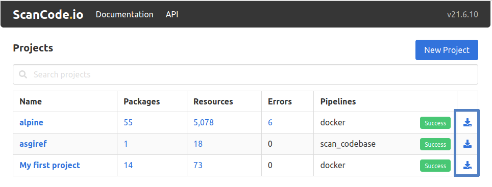

.. _output_files:

Output Files
============

Whether you use the command line or the web application to run your
scans, the generated results are available for review or export in
**JSON**, **Excel (XLSX)**, **SPDX**, and **CycloneDX** file formats.
You can also produce the **Attribution** as an HTML file.

.. tip::
    Check our :ref:`data_model` section for more details about all fields included
    in the output files.

Creating Output Files
---------------------

Command Line
^^^^^^^^^^^^
You can output the scan results using the ``output`` command while specifying
the output file format with the ``–-format`` option:

.. code-block:: console

    $ scanpipe output --project PROJECT --format {json,xlsx,spdx,cyclonedx,attribution}

.. note::
    The previous command will output the scan results in a file format
    – as specified – with the output files created in the
    ``PROJECT``'s :guilabel:`output/` directory. By default, JSON output
    files are created when no file format is given.

.. _mount_projects_workspace_volume:

.. warning::
    When running with Docker, ensure that the output files workspace is assigned
    to a volume to be accessible on the host machine.

    To add local input files to a project using the :ref:`command_line_interface`,
    additional arguments need to be passed to the ``docker compose`` command.

    For example, using the following command will mount and make available the
    projects workspace on the host at ``~/projects/``:

    .. code-block:: bash

        mkdir ~/projects/
        docker compose run --volume ~/projects/:/var/scancodeio/workspace/projects/ \
            web scanpipe output --project my_project --format json

    Alternatively, you can also locate the Docker volumes directory on your host
    machine. For instance, on Linux, it's typically found at:
    ``/var/lib/docker/volumes/``.

Web UI
^^^^^^
When using the ScanCode.io web application, you can download the results of your
project in your preferred output format within the project page.

You can also download the generated results—for any existing project—from the
ScanCode.io home screen.

Supported formats
-----------------

.. _output_files_json:

JSON
^^^^
The JSON file starts with some general information about the scan process,
including the scan tool, scan date, input file details, pipeline used, etc.,
as shown below

.. code-block:: json

  {
    "headers": [
      {
        "tool_name": "scanpipe",
        "tool_version": "21.6.10",
        "notice": "Generated with ScanCode and provided on an \"AS IS\" BASIS, WITHOUT WARRANTIES\nOR CONDITIONS OF ANY KIND, either express or implied. No content created from\nScanCode should be considered or used as legal advice. Consult an Attorney\nfor any legal advice.\nScanCode is a free software code scanning tool from nexB Inc. and others.\nVisit https://github.com/aboutcode-org/scancode-toolkit/ for support and download.",
        "uuid": "f06e257e-3126-4220-87c7-13583ced38a0",
        "created_date": "2021-06-12T19:51:26.218Z",
        "input_files": [
          "30-alpine-nickolashkraus-staticbox-latest.tar"
        ],
    "runs": [
      {
        "pipeline_name": "analyze_docker_image",
        "description": "A pipeline to analyze a Docker image.",
        "uuid": "5f1ec0c5-91ed-45c8-ab3d-beae44018716",
        "created_date": "2021-06-13T00:50:18.367560Z",
        "task_id": "e2085ee9-5804-4065-9a35-e25a883b8b62",
        "task_start_date": "2021-06-13T01:20:47.663939Z",
        "task_end_date": "2021-06-13T01:20:56.486136Z",
        "task_exitcode": 0,
        "task_output": "",
        "log": "2021-06-13 01:20:47.66 Pipeline [analyze_docker_image] starting\n2021-06-13 01:20:47.66 Step [extract_images] starting\n2021-06-13 01:20:47.72 Step [extract_images] completed in 0.05 seconds\n2021-06-13 01:20:47.72 Step [extract_layers] starting\n2021-06-13 01:20:47.84 Step [extract_layers] completed in 0.12 seconds\n2021-06-13 01:20:47.84 Step [find_images_linux_distro] starting\n2021-06-13 01:20:47.84 Step [find_images_linux_distro] completed in 0.00 seconds\n2021-06-13 01:20:47.85 Step [collect_images_information] starting\n2021-06-13 01:20:47.85 Step [collect_images_information] completed in 0.00 seconds\n2021-06-13 01:20:47.85 Step [collect_and_create_codebase_resources] starting\n2021-06-13 01:20:48.65 Step [collect_and_create_codebase_resources] completed in 0.79 seconds\n2021-06-13 01:20:48.65 Step [collect_and_create_system_packages] starting\n2021-06-13 01:20:50.89 Step [collect_and_create_system_packages] completed in 2.24 seconds\n2021-06-13 01:20:50.89 Step [flag_uninteresting_codebase_resources] starting\n2021-06-13 01:20:50.90 Step [tag_uninteresting_codebase_resources] completed in 0.00 seconds\n2021-06-13 01:20:50.90 Step [tag_empty_files] starting\n2021-06-13 01:20:50.91 Step [tag_empty_files] completed in 0.00 seconds\n2021-06-13 01:20:50.91 Step [scan_for_application_packages] starting\n2021-06-13 01:20:50.98 Step [scan_for_application_packages] completed in 0.07 seconds\n2021-06-13 01:20:50.98 Step [scan_for_files] starting\n2021-06-13 01:20:56.46 Step [scan_for_files] completed in 5.48 seconds\n2021-06-13 01:20:56.46 Step [analyze_scanned_files] starting\n2021-06-13 01:20:56.47 Step [analyze_scanned_files] completed in 0.00 seconds\n2021-06-13 01:20:56.47 Step [tag_not_analyzed_codebase_resources] starting\n2021-06-13 01:20:56.48 Step [tag_not_analyzed_codebase_resources] completed in 0.00 seconds\n2021-06-13 01:20:56.48 Pipeline completed\n",
        "execution_time": 8
      }
    ],
    "extra_data": {
      "images": [
        {
          "os": "linux",
          "tags": [
            "nickolashkraus/staticbox:latest"
          ],
          "author": null,
          "distro": {
            "os": "linux",
            "logo": null,
            "name": "Alpine Linux",
            "id_like": [],
            "variant": null,
            "version": null,
            "build_id": null,
            "cpe_name": null,
            "home_url": "https://alpinelinux.org/",
            "extra_data": {},
            "identifier": "alpine",
            "variant_id": null,
            "version_id": "3.11.3",
            "pretty_name": "Alpine Linux v3.11",
            "support_url": null,
            "architecture": "amd64",
            "bug_report_url": "https://bugs.alpinelinux.org/",
            "version_codename": null,
            "documentation_url": null,
            "privacy_policy_url": null
          },
          "labels": {},
          "sha256": null,
          "comment": null,
          "created": "2020-02-04T20:14:21.37837804Z",
          "history": [
            {
              "created": "2020-01-18T01:19:37.02673981Z",
              "created_by": "/bin/sh -c #(nop) ADD file:e69d441d729412d24675dcd33e04580885df99981cec43de8c9b24015313ff8e in / "
            },
            {
              "created": "2020-01-18T01:19:37.187497623Z",
              "created_by": "/bin/sh -c #(nop)  CMD [\"/bin/sh\"]",
              "empty_layer": true
            },
            {
              "created": "2020-02-04T20:14:18.651799654Z",
              "created_by": "/bin/sh -c #(nop) COPY file:0534399d8928526e71db5a2dd096bfa0548c3ea036b678eb596a76d2ddc2bdbf in /staticbox/bin/busybox "
            },
            {
              "created": "2020-02-04T20:14:20.986239348Z",
              "created_by": "/bin/sh -c for f in /bin/*; do if [[ -h $f  ]]; then ln -sf /staticbox/bin/busybox /staticbox/bin/$(basename $f); fi done"
            },
            {
              "created": "2020-02-04T20:14:21.37837804Z",
              "created_by": "/bin/sh -c #(nop)  ENV PATH=/staticbox/bin:/usr/local/sbin:/usr/local/bin:/usr/sbin:/usr/bin:/sbin:/bin",
              "empty_layer": true
            }
          ],
          "variant": null,
          "image_id": "7656d1f7594c21d805a02a8d71835064909491130ed7add6357b28d512f8d213",
          "os_version": null,
          "architecture": "amd64",
          "image_format": "docker",
          "config_digest": "sha256:7656d1f7594c21d805a02a8d71835064909491130ed7add6357b28d512f8d213",
          "docker_version": "18.03.1-ee-3"
        }
      ]
    }
  }],
  }

The JSON results file also lists information about any `packages` discovered
during the scan process with information about each individual `package`
similar to the following:

.. code-block:: json

    "packages": [
      {
        "purl": "pkg:alpine/musl@1.1.24-r0?arch=x86_64",
        "type": "alpine",
        "namespace": "",
        "name": "musl",
        "version": "1.1.24-r0",
        "qualifiers": "arch=x86_64",
        "subpath": "",
        "primary_language": "",
        "description": "the musl c library (libc) implementation",
        "release_date": "2019-11-15",
        "homepage_url": "http://www.musl-libc.org/",
        "download_url": "",
        "size": 376511,
        "sha1": "",
        "md5": "",
        "bug_tracking_url": "",
        "code_view_url": "",
        "vcs_url": "git+http://git.alpinelinux.org/aports/commit/?id=ba05f40c20ddc515f748f205f01befbba3a88feb",
        "copyright": "",
        "license_expression": "mit",
        "declared_license": "MIT",
        "notice_text": "",
        "missing_resources": [
          "/lib/libc.musl-x86_64.so.1"
        ],
        "modified_resources": [],
        "keywords": [],
        "source_packages": [
          "pkg:alpine/musl@1.1.24-r0"
        ]
      }
    ]

The results will also include all of the  or files (codebase resources) found.

.. note::
    Please note that these files might or might not be included within a package.

.. code-block:: json

    "files": [{
      "for_packages": [
        "pkg:alpine/busybox@1.31.1-r9?arch=x86_64"
      ],
      "compliance_alert": "",
      "path": "/30-alpine-nickolashkraus-staticbox-latest.tar-extract/5216338b40a7b96416b8b9858974bbe4acc3096ee60acbc4dfb1ee02aecceb10/bin/busybox",
      "size": 841288,
      "sha1": "593739e717ef3e8833034614576e03d189be30a1",
      "md5": "0234c668c5c93317e3f055fdd44f0943",
      "copyrights": [],
      "holders": [],
      "authors": [],
      "licenses": [],
      "license_expressions": [],
      "emails": [],
      "urls": [],
      "status": "system-package",
      "type": "file",
      "extra_data": {},
      "name": "busybox",
      "extension": "",
      "programming_language": "",
      "mime_type": "application/x-pie-executable",
      "file_type": "ELF 64-bit LSB pie executable, x86-64, version 1 (SYSV), dynamically linked, interpreter /lib/ld-musl-x86_64.so.1, stripped",
      "is_binary": true,
      "is_text": false,
      "is_archive": false
    }]

.. _output_files_xlsx:

Excel (XLSX)
^^^^^^^^^^^^
ScanCode.io can generate scan results in **Excel (.xlsx)** format. The exported file
contains multiple sheets, categorized by data type. The following sheets are
**always included**:

- **PACKAGES**: :ref:`data_models_discovered_package`
- **DEPENDENCIES**: :ref:`data_models_discovered_dependency`
- **RESOURCES**: :ref:`data_models_codebase_resource`
- **RELATIONS**: :ref:`data_models_codebase_relation`
- **MESSAGES**: :ref:`data_models_project_message`

Additional sheets are included **only when relevant** (i.e., when data is available):

- **LAYERS**: Included when scanning **container images** using the
  :ref:`pipeline_analyze_docker_image` pipeline.
- **TODOS**: Contains resources flagged as **"REQUIRES_REVIEW"**.
- **VULNERABILITIES**: Lists vulnerabilities detected in project **packages** and
  **dependencies**, typically when using the :ref:`pipeline_find_vulnerabilities`
  pipeline. This sheet is omitted if no vulnerabilities are found.

.. warning::
   Unlike JSON exports, the **XLSX output** does not include general scan metadata,
   such as tool version, execution date, or scan parameters.

   Since it contains only a subset of the project data, it **cannot** be used to
   recreate the project. For this purpose, prefer the :ref:`output_files_json` output.

.. _output_files_spdx:

SPDX
^^^^
ScanCode.io can generate Software Bill of Materials (SBOM) in the **SPDX** format,
which is an open standard for communicating software component information.
SPDX is widely used for license compliance, security analysis, and software supply
chain transparency.

For more details, visit: https://spdx.dev/

The SPDX output includes:

- **Packages:** Information about detected software packages, including name, version,
  licensing, and supplier details.
- **Files:** A list of scanned files with associated metadata, including licenses and
  copyright notices.
- **Relationships:** Dependencies and associations between packages and files.
- **Licenses:** License expressions for detected components.

.. note::
   ScanCode.io produces SPDX documents in **SPDX JSON and Tag/Value formats**.

.. _output_files_cyclonedx:

CycloneDX
^^^^^^^^^
ScanCode.io can generate **CycloneDX** SBOMs, a lightweight standard designed for
security and dependency management. CycloneDX is optimized for vulnerability analysis
and software supply chain risk assessment.

For more details, visit: https://cyclonedx.org/

The CycloneDX output includes:

- **Components:** A list of identified software components, including their
  versions and licensing information.
- **Dependencies:** Relationships between software components, useful for analyzing
  supply chain risks.
- **Vulnerabilities (when available):** If vulnerability scanning is enabled,
  detected vulnerabilities will be included in the CycloneDX output.
- **Metadata:** Information about the scan, including tool details and execution data.

.. note::
   ScanCode.io produces CycloneDX SBOMs in **JSON format**.

.. _output_files_attribution:

Attribution
^^^^^^^^^^^
ScanCode.io can generate attribution notices of the discovered packages of a project.
The output format is a HTML page.

The default template output can be customized providing your own template in the
:guilabel:`.scancode` config directory :ref:`scancodeio_settings_config_dir`.

You usually want to start with a copy of the default template available at
``scanpipe/templates/scanpipe/attribution.html`` and add your modifications.

You can then place your custom template file into the :guilabel:`.scancode` config
directory in your input files, such as it will end up at
``codebase/.scancode/templates/attribution.html`` on extraction.

The following variable are available as the template context:

- ``project``
- ``packages``
- ``licenses``

Refer to :ref:`data_model` for the full details of available fields.
