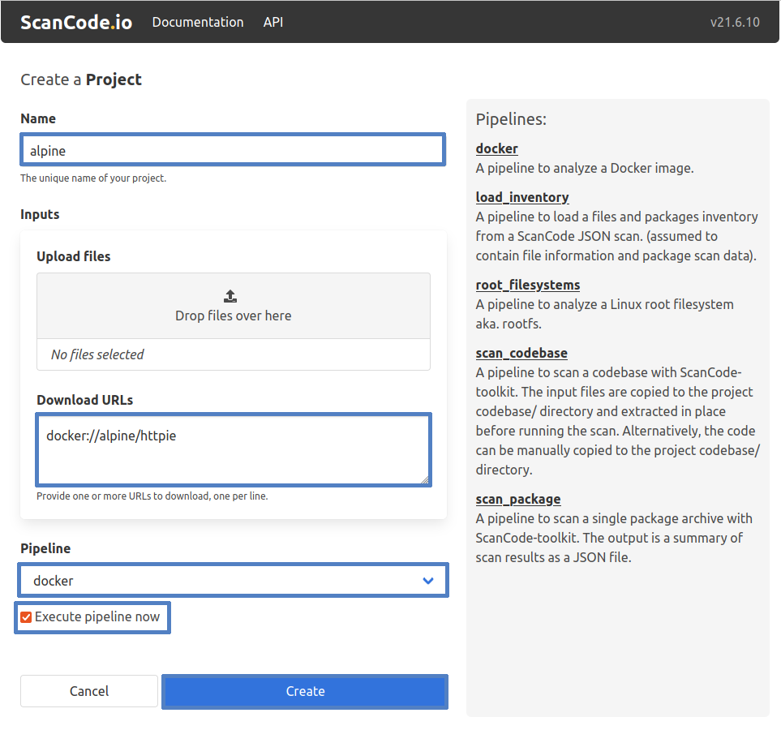
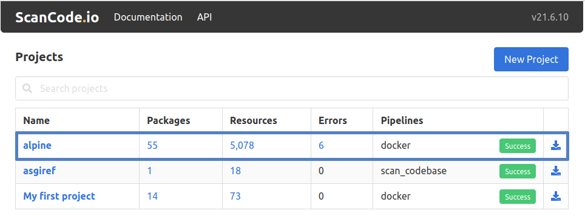

.. _tutorial_3:

Analyze Docker Image (Web UI)
=============================

This tutorial aims to show you how to scan a docker image input file using the
ScanCode Web UI while introducing you to the interface's various features.

.. tip::
    This tutorial is intended for anyone who prefers interacting with a visual
    interface when working with ScanCode.io. If you prefer using the command
    line, you can check our command line tutorials.

.. note::
    This tutorial assumes you have a current version of ScanCode.io installed
    locally on your machine with an access to the ScanCode Web UI. If you do not
    have them already, you can take a look at our :ref:`installation` guide
    for instructions.

Requirements
------------
We’ll assume that you have:

- Installed **ScanCode.io** locally
- Access to the web application from your preferred browser on http://127.0.0.1:8001/

.. tip::
    You can view our :ref:`user_interface` section for general information about
    the ScanCode.io UI.

Instructions
------------

- From the homepage, click on the **"New Project"** button to create a new
  project named ``alpine``. You will be directed to the **"Create a Project"**
  page where you need to fill in the new project's details.
- Paste the input Docker image's URL, `docker://alpine/httpie <https://hub.docker.com/r/alpine/httpie/>`_
  , in the **Download URL** field, which fetches the image from the provided
  URL.
- Use the **"Pipeline"** dropdown list, add the docker pipeline to your project
- You can add and execute the docker pipeline in one operation by checking the
  **"Execute pipeline now"** checkbox.

.. note::
    You can create a new project while leaving the **Inputs** and
    **Pipeline** fields blank; however, it's required to provide a project
    **Name**!

- Finally, click the **"Create"** button

.. note::
    Please note that when you choose to create a new project and execute the
    pipeline in one operation, the process may take few minutes before it
    completes.

The previous screenshot shows the ScanCode.io home screen with the new "alpine"
project and other existing projects. The home screen also shows a summary of
the number of **Packages**, **Code Resources**, and **Errors**—if any—discovered
during the scan process. It also contains any **Pipelines** used and their
execution status, i.e. **SUCCESS**, **FAILURE**, or **NOT_STARTED**. Plus, the
ability to download the generated results in **JSON** and **Excel (XLSX)** file
formats.

.. tip::
    Refer to the complementary :ref:`tutorial_4` page, to understand this
    tutorial's scan results/output.
