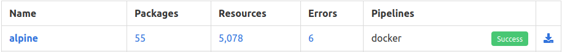
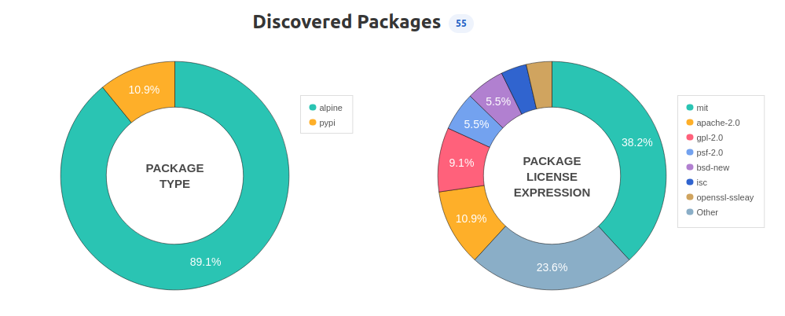
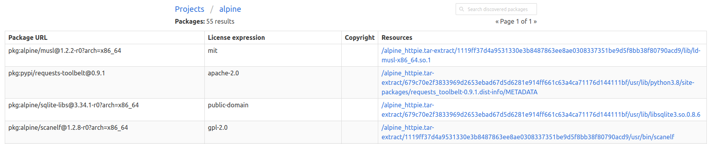
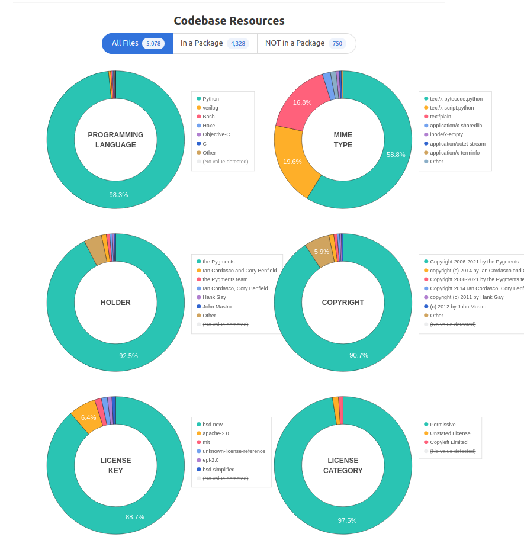
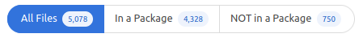
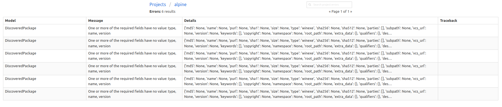
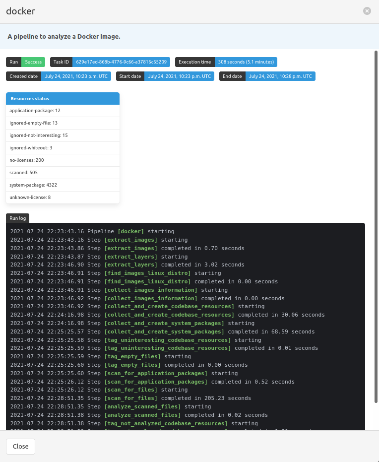

.. _tutorial_4:

Review Scan Results (Web UI)
============================

This chapter is complementary to the :ref:`tutorial_3` tutorial, and the output
shown here is the generated results of that tutorial's pipeline run.
The goal here is to guide you on how to understand and review your scan
results using the ScanCode.io web interface.

.. tip::
    As a perquisite, follow the :ref:`tutorial_3` tutorial to have a better
    understanding of the results included here.

On the homepage, you can click on the project name in the summary table to
access a detailed scan output page. You can also click any of the numbers
underneath the **Packages**, **Resources**, or **Errors** fields to be directed
to the field's corresponding information. Further, clicking on the pipeline's
execution status—**SUCCESS** in this case—expands some extra pipeline details,
Resources status, and Run log.

.. note::
    You can also view output-related information, in graphical representation,
    in each project page. Plus, other project data and input details.

    .. image:: images/alpine-project-page.png

In general, the output of any pipeline run includes details about:

Packages
--------
A summary of **Discovered Packages** in a graphical format is shown in the
project page that includes two Pie/Doughnut charts, which filter all packages
found by their **Type** and **License Expression**:

The two circular charts are interactive and can be filtered further by clicking
any of the categories—**Type** and **License Expression**—on the right of each
graph. Also, you can expand more details about any category separately,
in tabular format, when you click its corresponding slice colour.

In addition, there is also an overall detailed table that includes all packages
found and code resources within each package, which can be accessed by clicking
on the **Packages** number field.

Resources
---------
Similar to **Packages**, the total number of discovered **Codebase Resources**
is shown on both ScanCode.io homepage and the "alpine" project page. Clicking on
this number reveals a detailed table for all found code resources.

Further, the project page offers a group of Doughnut charts that filter code
resources by **Programming Language**, **Mime Type**, **Holder**, **Copyright**,
**License Key**, and **License Category**.

.. note::
    The charts above show all discovered Codebase files by default regardless of
    their existance within a package. You can still only view a subset, i.e.,
    **In a Package** or **Not in a Package**

Errors
------
In addition to discovered packages and codebase resources, the ScanCode.io
homepage shows the number of existing errors, which you can click for detailed
description of each error.

Other Information
-----------------
Clicking on the pipeline's execution status—**SUCCESS** in this case—opens a
new window with some extra pipeline-specific details, such start and end date,
launch, execution time and status, run log, etc.

