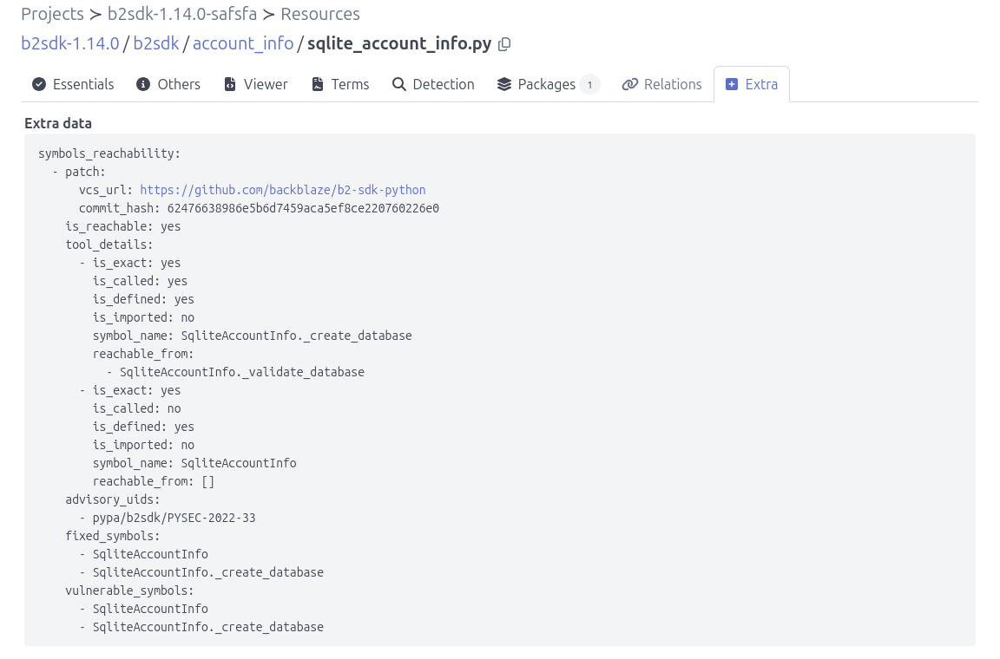

.. _tutorial_analyze_symbols_reachability:

Analyze Symbol Reachability
===========================

In this tutorial, we will introduce the add-on pipeline that can be used to
analyze symbols from codebase resources.

Requirements
------------

To successfully complete this tutorial, you first need to:

- Install **ScanCode.io** locally :ref:`installation`.
- Have an existing project resource that is directly affected by a
  vulnerability advisory and has at least one fix commit.
- Run the ``find_vulnerabilities`` pipeline :ref:`tutorial_vulnerablecode_integration`.

Reachability Status
-------------------

The reachability status can have one of the following values:

- ``REACHABLE``: "Yes"
  (We found evidence that the vulnerable symbol is reachable and the vulnerable code exists.)
- ``UNKNOWN``: "UNKNOWN"
  (We cannot determine reachability with confidence.)
- ``NOT_REACHABLE``: "No"
  (We found evidence that the vulnerable symbol is not reachable.)

Run the ``analyze_symbols_reachability`` pipeline
-------------------------------------------------

- Open any existing project containing a few resources.
- Click the **"Add pipeline"** button and select the **"analyze_symbols_reachability"**
  pipeline from the dropdown list.
- Select **"Execute pipeline now"** and click **"Add pipeline"** to start the
  reachability analysis.
- Once the pipeline run completes successfully, you can reach the **Resources** list view
  by clicking the count number under the **"RESOURCES"** header.
- Click on one of the affected code files and navigate to
  the **Extra** tab to view the ``symbols_reachability``.

- The pipeline output also includes a JSON file containing the reachability
  status for each advisory and resource, including the overall reachability
  status (e.g., ``reachability-2026-08-18-15-12-51.json``).

.. code-block:: json
    :emphasize-lines: 2

    {
      "pypa/b2sdk/PYSEC-2022-33": {
        "reachable": "YES",
        "details": [
          {
            "resource_path": "b2sdk-1.14.0/b2sdk/account_info/sqlite_account_info.py",
            "patch": {
              "vcs_url": "https://github.com/backblaze/b2-sdk-python",
              "commit_hash": "62476638986e5b6d7459aca5ef8ce220760226e0"
            },
            "reachability_status": "YES",
            "evidence": [
              {
                "symbol_name": "SqliteAccountInfo._create_database",
                "called": true,
                "defined": true,
                "imported": false,
                "fingerprint": "43b2cc475fd9704759ab9c05a4e96e2b24859f9c63873773db7c35fc4ff09991",
                "reachable_from": [
                  "SqliteAccountInfo._validate_database"
                ]
              },
              {
                "symbol_name": "SqliteAccountInfo",
                "called": false,
                "defined": true,
                "imported": false,
                "fingerprint": "8878c1a51c52f9f13f4e877c072a045ef5104ae4eeebadec92ba28f19a792e9f",
                "reachable_from": []
              }
            ],
            "vulnerable_symbols": [
              "SqliteAccountInfo",
              "SqliteAccountInfo._create_database"
            ],
            "fixed_symbols": [
              "SqliteAccountInfo",
              "SqliteAccountInfo._create_database"
            ]
          },
          // ... more details
        ]
      }
    }

.. note::
    An advisory is considered ``REACHABLE`` if it is reachable through at least
    one resource. If no resource is ``REACHABLE`` and at least one result is
    ``UNKNOWN``, the advisory status is ``UNKNOWN``. Otherwise, its status is
    ``NOT_REACHABLE``.
