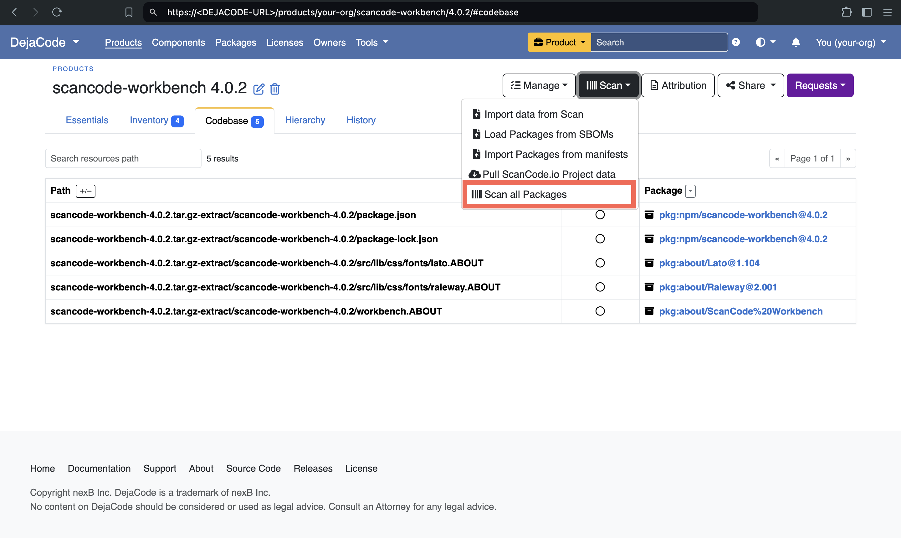
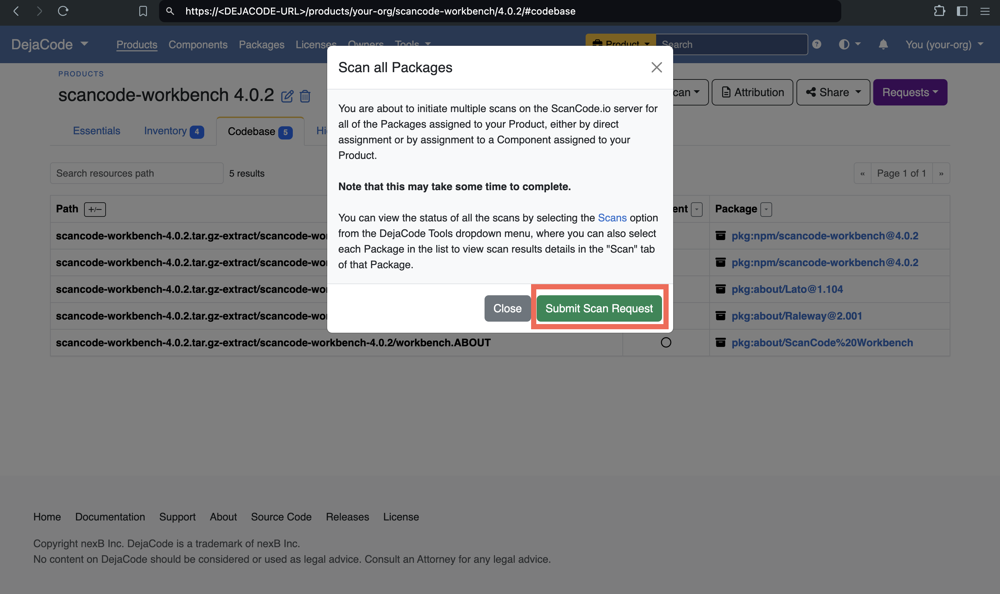

.. _tutorial_cli_end_to_end_scanning_to_dejacode:

Analyze Codebase End to End with DepLock and DejaCode (Command Line)
=====================================================================

The focus of this tutorial is to guide you through scanning a codebase end to end,
starting with the dependency resolution, through the scanning proper, and finally
the upload of the scan in DejaCode, using DepLock and ScanCode.io.

This is designed to run a faster, simple **inspect_packages** ScanCode.io pipeline.

.. note::
    This tutorial assumes you have Docker installed locally on your machine and that you have
    access to a DejaCode installation with an API key. See the DejaCode installation guide
    for installation instructions: https://dejacode.readthedocs.io/en/latest/installation.html

Requirements
------------

Before you follow the instructions in this tutorial, you need to:

- Have **Shell access** on the machine where docker is installed.
- Have the API URL and API key for your DejaCode instance.

Docker Engine installation
~~~~~~~~~~~~~~~~~~~~~~~~~~

The ScanCode app container requires the Docker engine to run scans.
If you haven't already, install Docker on your machine by referring
to the `official Docker documentation <https://docs.docker.com/get-docker/>`_
and following the installation instructions.

Outline of the processing steps
--------------------------------

The process for this tutorial is to:

1. Fetch the codebase to scan.
2. Ensure that it contains a proper scancode-config.yml file with references to a DejaCode
   product and version for this codebase.
3. Download and run the latest DepLock for each ecosystem of this codebase.
4. Run ScanCode.io and collect results.
5. Upload the scans results to DejaCode for the product of this codebase.
6. Trigger detailed scan in DejaCode for all packages of the product.

.. note::
    Below instructions have been tested only on Linux for now.

Fetch codebase to scan
----------------------

**Local Project Codebase**: Ensure you have a local checkout of your project's codebase.

We are using this repo for our tutorial: https://github.com/aboutcode-org/scancode-workbench

We download the following: https://github.com/aboutcode-org/scancode-workbench/archive/refs/tags/v4.0.2.tar.gz

Extract the checkout and delete the archive:

.. code-block:: shell

    tar -xzf scancode-workbench-4.0.2.tar.gz && rm scancode-workbench-4.0.2.tar.gz

Create scancode-config.yml config file
--------------------------------------

Add the scancode-config.yml file for ScanCode.io.

Here we provide the product name and version and also configure it to
ignore test files and development dependencies.

.. code-block:: yaml
    :caption: scancode-config.yml
    :emphasize-lines: 4, 6-7

    product_name: scancode-workbench
    product_version: '4.0.2'
    ignored_patterns:
      - 'tests/*'
    ignored_dependency_scopes:
      - package_type: npm
        scope: devDependencies

.. note::
    See :ref:`project_configuration_settings` for all the available
    scancode-config settings and details about each setting.

Download and run DepLock
------------------------

Now we will use DepLock to make sure that all the lockfiles are in place before we run our scan.

Download the latest DepLock binary depending on your OS and architecture:

.. code-block:: shell

    # Replace <OS> with your operating system (linux, darwin, windows)
    # Replace <ARCH> with your architecture (amd64, arm64)
    curl -LO https://github.com/nexB/dependency-inspector/releases/latest/download/deplock-<OS>-<ARCH>

- Here, we are on amd64 linux and will use:

  .. code-block:: shell

      curl -LO https://github.com/nexB/dependency-inspector/releases/latest/download/deplock-linux-amd64

- Make the binary executable:

  .. code-block:: shell

      chmod +x deplock-linux-amd64

- Run DepLock on scancode-workbench-4.0.2:

  .. code-block:: shell

      ./deplock-linux-amd64 npm scancode-workbench-4.0.2

.. note::
    Since the workbench is entirely an npm project, we are running npm only.
    If your project uses multiple package managers, run DepLock for all the
    package manager ecosystems. See the supported ecosystems here:
    https://github.com/nexB/dependency-inspector?tab=readme-ov-file#supported-ecosystems.

.. tip::
    If your project is composed of multiple packages, let's suppose it's a monorepo
    for multiple npm packages. Then, run DepLock for each package and provide the
    root of each package as the path.

    In the case of a NuGet project containing multiple packages, run ``./deplock-linux-amd64 nuget``
    at the root of the entire project, and there is no need to run it separately for each package.

Run ScanCode Package Detection
-------------------------------

Execute the following command to run the ScanCode scanner
with **inspect_packages** pipeline with static resolution
on the codebase in our current directory.

.. code-block:: shell

    docker run --rm \
      -v "$(pwd)":/code \
      ghcr.io/aboutcode-org/scancode.io:latest \
      sh -c "run inspect_packages:StaticResolver /code" \
      > results.json

Once completed, you will find the `results.json`
**results file in your current directory**.

Upload Scan Results in DejaCode
--------------------------------

To upload the scan results stored in the ``results.json`` file to DejaCode,
we need to ensure that we have a product set up for this project in DejaCode.

- **Create Product on DejaCode**

    .. note::
        You can skip this step if you already have a product in DejaCode, just get
        the ``UUID`` of the product and proceed to the next step.

    Run this command to create the scancode-workbench v4.0.2 product in DejaCode:

    Replace `<DEJACODE-URL>` with your DejaCode URL and `<YOUR-DEJACODE-API-KEY>` with your DejaCode API key.

    .. code-block:: shell

        curl -X POST "https://<DEJACODE-URL>/api/v2/products/" \
            -H "Authorization: Token <YOUR-DEJACODE-API-KEY>" \
            -H "Content-Type: application/json" \
            -d '{
                    "name": "scancode-workbench",
                    "version": "4.0.2",
                    "vcs_url": "https://github.com/aboutcode-org/scancode-workbench.git",
                    "homepage_url": "https://github.com/aboutcode-org/scancode-workbench"
                }'

    .. tip::
        Apart from name, version, and vcs_url, you can provide a host of parameters.
        See `https://<DEJACODE-URL>/api/v2/docs/#products-create` for more details.

    We get the below response, and we need to grab the ``UUID`` from the highlighted line in the JSON response.

    .. code-block:: json
        :emphasize-lines: 5

        {
            "display_name":"scancode-workbench 4.0.2",
            "api_url":"https://<DEJACODE-URL>/api/v2/products/<UUID>/",
            "absolute_url":"https://<DEJACODE-URL>/products/your-org/scancode-workbench/4.0.2/",
            "uuid":"<UUID>",
            "name":"scancode-workbench",
            "version":"4.0.2",
            "owner":null,
            "configuration_status":"New",
            "license_expression":"",
            "licenses":[],
            "components":[],
            "packages":[],
            "keywords":[],
            "release_date":null,
            "description":"",
            "copyright":"",
            "contact":"",
            "homepage_url":"https://github.com/aboutcode-org/scancode-workbench",
            "vcs_url":"https://github.com/aboutcode-org/scancode-workbench.git",
            "code_view_url":"",
            "bug_tracking_url":"",
            "primary_language":"",
            "admin_notes":"",
            "notice_text":"",
            "created_date":"<Redacted>",
            "last_modified_date":"<Redacted>",
            "dataspace":"your-org"
        }

- **Upload Product on DejaCode**

    Finally, we can use the ``UUID`` from the above step to upload the scan results to DejaCode.

    Replace `<DEJACODE-URL>` with your DejaCode URL, `<YOUR-DEJACODE-API-KEY>` with your DejaCode
    API key, and `<UUID>` with the UUID for the product we created in the above step.

    .. code-block:: shell

        curl -X POST "https://<DEJACODE-URL>/api/v2/products/<UUID>/import_from_scan/" \
            -H "Authorization: Token <YOUR-DEJACODE-API-KEY>" \
            -F "upload_file=@results.json" \
            -F "create_codebase_resources=true" \
            -F "stop_on_error=true"

    Upon successful upload, we get this response:

    .. code-block:: json

        {"status":"Imported from Scan: 4 Packages, 4 Product Packages, 5 Codebase Resources"}

Trigger detailed Scan in DejaCode for all packages of the product
-----------------------------------------------------------------

To trigger a detailed scan of all packages in the uploaded product we will use
DejaCode UI, go to `https://<DEJACODE-URL>/products/your-org/scancode-workbench/4.0.2/`,
click on the `Scan` dropdown, and choose `Scan all Packages`.

In the confirmation dialog, click `Submit Scan Request`.

