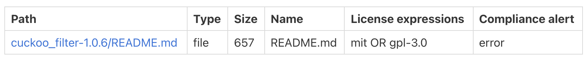

.. _tutorial_license_policies:

License Policies and Compliance Alerts
======================================

In this tutorial, we'll introduce ScanCode.io's **license policies** and **compliance
alerts** system and use the **results of a pipeline run** to demonstrate an example
of the license policies and compliance alerts output.

As already mentioned, ScanCode.io automates the process of **Software Composition
Analysis "SCA"** to identify existing open source components and their license
compliance data in an application's codebase.

ScanCode.io also gives users the ability to define a set of **license policies** to
have their projects checked against with a **compliance system**.

Creating Policies Files
-----------------------

A valid policies file is required to **enable compliance-related features**.

The policies file, by default ``policies.yml``, is a **YAML file** with a structure
similar to the following:

.. code-block:: yaml

    license_policies:
    -   license_key: mit
        label: Approved License
        compliance_alert: ''
    -   license_key: mpl-2.0
        label: Restricted License
        compliance_alert: warning
    -   license_key: gpl-3.0
        label: Prohibited License
        compliance_alert: error

- In the above policies file, licenses are referenced by the ``license_key``,
  such as mit and gpl-3.0, which represents the ScanCode license key to match
  against detected licenses in the scan results.
- A policy is defined with a ``label`` and a ``compliance_alert``.
  The labels can be customized to your prefered wording.
- The ``compliance_alert`` accepts 3 values:

   - ``''`` (empty string)
   - ``warning``
   - ``error``

Policies File Location
----------------------

By default, ScanCode.io will look for a ``policies.yml`` file at the root of its
codebase.

Alternatively, you can configure the location of policies files using the
dedicated :ref:`scancodeio_settings_policies_file` setting in your ``.env`` file.

.. tip::
    Check out our :ref:`scancodeio_settings` section for a comprehensive list of
    settings including policies file setting.

How Does The Compliance Alert Work?
-----------------------------------

The compliance system works by following a ``Precedence of Policies`` principal
allowing the highest precedence policy to be applied in case of resources or
packages with complex license expressions:

- **error > warning > missing > '' (empty string)**

This principal means a given resource with ``error AND warning AND ''``
license expression would have an overall compliance alert of ``error``.

.. warning::
    The ``missing`` compliance alert value is applied for licenses not present in the
    policies file.

Example Output
--------------

Create a ``policies.yml`` file in the root directory of your ScanCode.io codebase, with
the following content:

.. code-block:: yaml

    license_policies:
    -   license_key: mit
        label: Approved License
        compliance_alert: ''
    -   license_key: gpl-3.0
        label: Prohibited License
        compliance_alert: error

Run the following command to create a project and run the ``scan_codebase`` pipeline:

.. code-block:: bash

    $ scanpipe create-project cuckoo-filter-with-policies \
        --input-url https://files.pythonhosted.org/packages/75/fc/f5b2e466d763dcc381d5127b73ffc265e8cdaf39ddafa422b7896e625432/cuckoo_filter-1.0.6.tar.gz \
        --pipeline scan_codebase \
        --execute

Generate results:

.. code-block:: bash

    $ scanpipe output --project cuckoo-filter-with-policies

The computed compliance alerts are now included in the results, available for each
detected licenses, and computed at the codebase resource level, for example:

.. code-block:: json

    {
      "for_packages": [],
      "compliance_alert": "error",
      "path": "cuckoo_filter-1.0.6.tar.gz-extract/cuckoo_filter-1.0.6/README.md",
      "licenses": [
        {
          "key": "mit",
          "name": "MIT License",
          "policy": {
            "label": "Recommended License",
            "compliance_alert": ""
          },
        }
        {
          "key": "gpl-3.0",
          "name": "GNU General Public License 3.0",
          "policy": {
            "label": "Prohibited License",
            "compliance_alert": "error"
        },
      ],
      "license_expressions": [
        "mit OR gpl-3.0",
      ],
      "status": "scanned",
      "name": "README",
      "[...]": "[...]"
    }

The compliance alert are also displayed in the Web UI:

