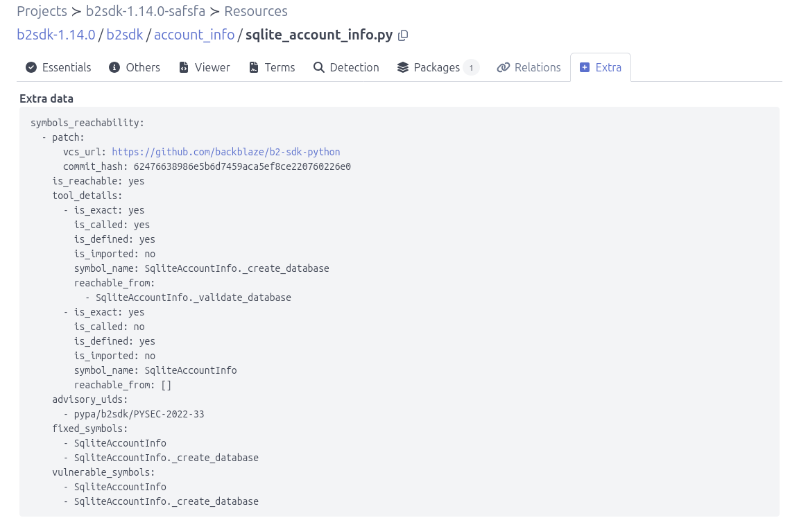

.. _tutorial_reachability_integration_tools:

Integrate Other Reachability Tools
==================================

This tutorial shows how to integrate any reachability analysis tool with
ScanCode.io.

Most open source code analysis tools can create a call graph and run query manually
based on that to get reachability details, but do not
provide a complete end-to-end workflow for deciding whether those
vulnerabilities are actually *reachable* from the application code. ScanCode.io
fills this gap by letting you plug in your own reachability analysis:

1. Scan the project with the ``scan_codebase`` pipeline to collect its package
   and file details.
2. Run the ``find_vulnerabilities`` pipeline to collect the list of all the
   vulnerabilities found in the codebase. This requires a configured
   VulnerableCode service. see: :ref:`tutorial_vulnerablecode_integration`.
3. Run your own reachability pipeline, such as ``awesome_reachability``, to
   get a reachability report for each vulnerability.

How the integration works
--------------------------

The integration is based on two base classes, available in the
``scanpipe.pipes.reachability_tools`` module:

- ``ReachabilityTool`` wraps a reachability analysis tool. It declares the tool
  ``tool_name``, its ``executable``, and the programming languages it supports
  (``supported_languages``), and implements the tool-specific logic: checking
  the tool availability, running the tool, parsing its output.

- ``ReachabilityPipeline`` orchestrates the whole workflow.

The base pipeline already implements most of the steps:

- ``get_candidate_resources``: Collect non-binary, non-archive, non-media source
  files for analysis.

- ``get_vulnerabilities_patches``: collects the vulnerability patches for the
  project packages.

- ``collect_patch_symbols``: collects the vulnerable and fixed symbols for each
  patch.
- ``generate_advisory_reachability_report``: generates a reachability report for
  each vulnerability advisory.
- ``apply_reachability_to_packages_and_dependencies``: stores the reachability
  results on the matching packages and dependencies.

What you need to implement
---------------------------

To integrate a reachability tool, you only need to:

1. Subclass ``ReachabilityTool`` and implement the tool-specific logic, such
   as:

   - ``get_availability``: return an error message when the tool is not
     available, for example when its executable is not configured.
   - ``run``: run the tool on the project codebase and return the path
     to its output file.
   - ``parsed_output``: load and return the tool output. The output format is
     tool-specific; in this example, a JSON file.

2. Subclass ``ReachabilityPipeline``, set its ``reachability_tool`` attribute
   to your tool class, and implement the two remaining steps:

   - ``collect_resource_index``: run the tool on the project codebase and load
     the resulting index of resource symbols, for example as
     ``self.resource_indexes``. This is also where you select the resources
     eligible for analysis, such as ``self.candidate_resources``.
   - ``collect_and_match_resources``: match the resource symbols against the
     vulnerable and fixed symbols of each patch, and record the reachability
     results. This method can rely on the ``self.patches`` and
     ``self.patch_symbols`` values collected by the base pipeline steps.

Example integration
--------------------

The following example integrates a fictional ``awesome_reachability`` tool.
Replace the tool name, executable, command line, output format, and matching
symbol logic with those of the tool you are integrating.

.. code-block:: python

   AWESOME_TOOL_EXECUTABLE = environ.get("AWESOME_TOOL_EXECUTABLE")

   class AwesomeReachabilityTool(ReachabilityTool):
       """Reachability analysis using the "awesome_reachability" tool."""

       tool_name = "awesome_reachability"
       executable = AWESOME_TOOL_EXECUTABLE
       supported_language = ("Python", ...)

       @classmethod
       def get_availability(cls):
           """Return an error message when the tool is not available."""
           if not cls.executable:
               return "The awesome_reachability tool is not configured."

       @classmethod
       def run(cls, project, logger=None):
          ...

       @classmethod
       def parsed_output(cls, target_path):
          ...

   class AwesomeReachability(ReachabilityPipeline):
       reachability_tool = AwesomeReachabilityTool

       def collect_resource_index(self):
          ...

       def collect_and_match_resources(self):
          ...

Data structures
~~~~~~~~~~~~~~~

The base pipeline collects the vulnerability data and exposes it as
pipeline attributes. When implementing ``match_patches_to_resources``
and ``collect_and_match_resources``, you can rely on the following
structures.

``patches``
++++++++++++++++

Collected by the ``get_vulnerabilities_patches`` step, this is a list of
unique patches. Each patch is identified by a ``(vcs_url, commit_hash)``
pair and lists the identifiers of the advisories it fixes:

.. code-block:: python

   self.patches = [
       {
           "vcs_url": "https://github.com/aboutcode-org/test",
           "commit_hash": "07ec0de1964b14bf085a1c9a27ece2b61ab6105c",
           "advisory_uids": ["PYSEC-2025-1"],
       },
   ]

``patch_symbols``
++++++++++++++++++++++

Collected by the ``collect_patch_symbols`` step, this maps each
``commit_hash`` to the vulnerable and fixed symbols extracted from the
patch, grouped by programming language:

.. code-block:: python

   self.patch_symbols = {
       "07ec0de1964b14bf085a1c9a27ece2b61ab6105c": {
           "Python": {
               "vulnerable": {
                   "app.py::serve_report.build_file_path": {
                       "qualified_name": "serve_report.build_file_path",
                       "text": "def build_file_path(filename): ...",
                       "fingerprint": "762e4f7d03b1bf4359c3ca364e55814...",
                       "start_line": 19,
                       "end_line": 22,
                       "node_type": "function_definition",
                   },
               },
               "fixed": {
                   "app.py::serve_report.build_file_path": {
                       "qualified_name": "serve_report.build_file_path",
                       "text": "def build_file_path(filename): ...",
                       "fingerprint": "646743b5d5497f6ea3b96f860bcbeb38...",
                       "start_line": 19,
                       "end_line": 25,
                       "node_type": "function_definition",
                   },
               },
           },
       },
   }

Notes:

- Symbols are keyed as ``"<file_path>::<qualified_name>"``, and
  ``qualified_name`` uses the language separator (``.``) for nested
  symbols, such as ``ClassName.method_name``.
- ``fingerprint`` is the SHA-256 of the symbol body ``text``. It is
  used for exact matching between a patch symbol and a resource symbol.
- ``start_line`` and ``end_line`` are 1-based line numbers of the symbol
  in its file.
- ``node_type`` is a syntax node type from tree-sitter, such as ``function_definition``,
  ``class_definition``, ..
- The language keys, such as ``"Python"`` or ``"Java"``.

Run the ``awesome_reachability`` pipeline
-------------------------------------------------

- Open any existing project containing a few resources.
- Click the **"Add pipeline"** button and select the **"awesome_reachability"**
  pipeline from the dropdown list.
- Select **"Execute pipeline now"** and click **"Add pipeline"** to start the
  reachability analysis.
- Once the pipeline run completes successfully, you can reach the **Resources** list view
  by clicking the count number under the **"RESOURCES"** header.
- Click on one of the affected code files and navigate to
  the **Extra** tab to view the ``symbols_reachability``.

- The pipeline output must includes a JSON file containing the reachability
  status for each advisory and resource, including the overall reachability
  status (e.g., ``reachability-2026-08-18-15-12-51.json``).

.. code-block:: json
    :emphasize-lines: 2

    {
      "purl": "pkg:pypi/b2sdk@1.14.0",
      "advisories": [
        {
          "advisory_uid": "pypa/b2sdk/PYSEC-2022-33",
          "is_reachable": "yes",
          "details": [],
          "vulnerable_symbols": [
            "SqliteAccountInfo",
            "SqliteAccountInfo._create_database"
          ],
          "fixed_symbols": [
            "SqliteAccountInfo",
            "SqliteAccountInfo._create_database"
          ]
        }]
        }
    }
