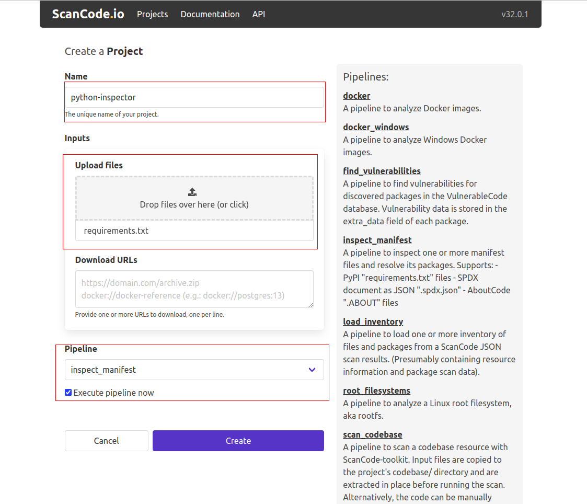
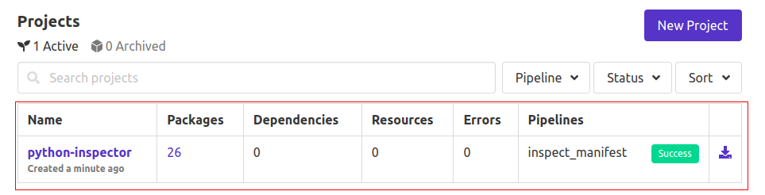
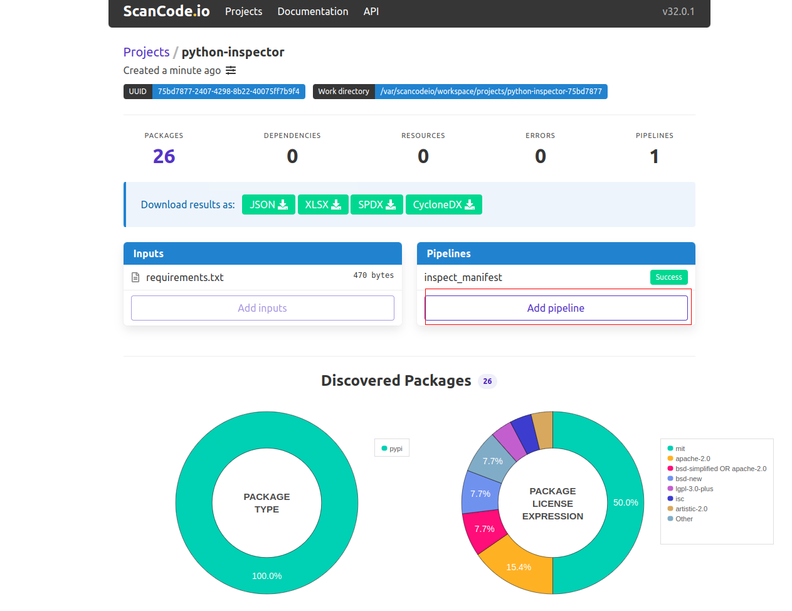
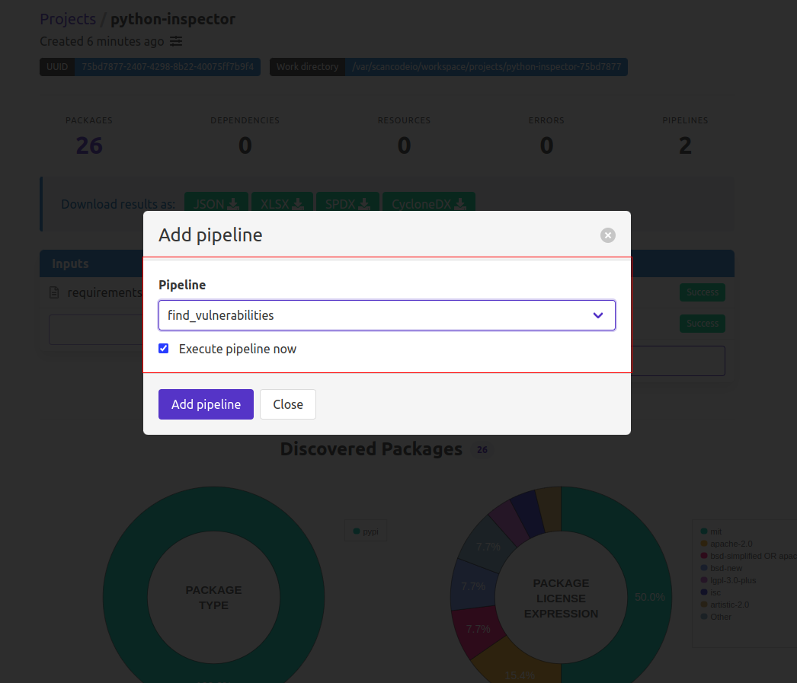

.. _vulnerablecode_integration:

Run find vulnerabilities in ScanCode.io
=========================================

This chapter describes how to integrate VulnerableCode
with ScanCode.io and how to run the ``find_vulnerabilities`` pipeline.
``find_vulnerabilities`` is a pipeline to find vulnerabilities for
discovered packages in the VulnerableCode database.
Vulnerability data is stored in the extra_data field of
each package in JSON file format.

Instructions to integrate VulnerableCode with ScanCode.io
----------------------------------------------------------

.. note::
    This tutorial assumes that you have a working installation of ScanCode.io.
    If you don't, please refer to the :ref:`installation` page.

To run ``find_vulnerabilities`` pipeline with VulnerableCode, you need to
have a public instance of VulnerableCode and a VulnerableCode API key.

Here are the instructions to integrate VulnerableCode with Scancode.io:

- First, you need a VulnerableCode installation. We assume that you use the public
  instance at ``https://public.vulnerablecode.io/``

- Create an API user in this instance at https://public.vulnerablecode.io/account/request_api_key/
  and make note of the API key.

Run SCIO with these settings:

- In Scancode.io, you will need to add the environment variables in the ``docker.env``
  file if your run with docker or in the ``.env`` for a local development deployment:

  - Set the environment variable ``VULNERABLECODE_URL`` pointing to your
    VulnerableCode URL, for example ``https://public.vulnerablecode.io/``

  - Set the environment variable ``VULNERABLECODE_API_KEY`` with your API key.

The resulting ``docker.env`` file should look like this::

    VULNERABLECODE_URL = "https://public.vulnerablecode.io/"
    VULNERABLECODE_API_KEY = "paste your vulnerablecode API key here"

.. note::
    Optionally contact nexB support at support@nexb.com with your API user email if
    you are doing a larger scale evaluation and need to ease API throttling limitations.

Instructions to run the ``find_vulnerabilities`` pipeline
----------------------------------------------------------

- From the homepage, click on the “New Project” button to
  create a new project named ``python-inspector``. You will be directed
  to the “Create a Project” page where you need to fill in the new project’s details.
- Upload the ``requirements.txt`` file in the **"Upload files"** section.
- Use the **“Pipeline”** dropdown list, add the **“inspect_manifest”** pipeline to your project.
- You can add and execute the pipeline in one operation by
  checking the **“Execute pipeline now”** checkbox.

.. note::
    You can create a new project while leaving the **Inputs** and
    **Pipeline** fields blank; however, it's required to provide a project
    **Name**!

- Finally, click the **"Create"** button

.. note::
    Please note that when you choose to create a new project and execute the
    pipeline in one operation, the process may take few minutes before it
    completes.

- The previous screenshot shows the ScanCode.io home screen with the new
  "python-inspector” project and other existing projects.
  Select python-inspector to view the project details.

- Click on the **"Add pipeline”** button and select
  **“find_vulnerabilities”** from the dropdown list.

- You can add and execute the pipeline in one operation by checking the **“Execute pipeline now”**
  checkbox and click the **"Add pipeline"** button.

.. tip::
    Refer to the complementary :ref:`tutorial_web_ui_review_scan_results` page, to
    understand this tutorial's scan results/output.
