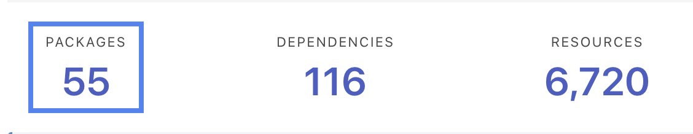
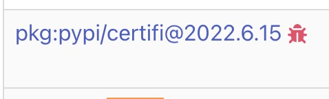
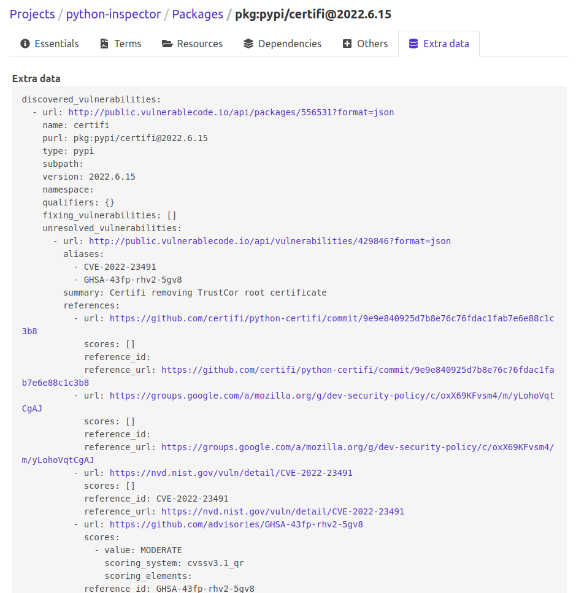

.. _tutorial_vulnerablecode_integration:

Find vulnerabilities (Web UI)
=============================

This tutorial aims to show you how to integrate VulnerableCode with ScanCode.io and
how to discover vulnerable packages using the ``find_vulnerabilities`` pipeline.

.. note::
    This tutorial assumes that you have a working installation of ScanCode.io.
    If you don't, please refer to the :ref:`installation` page.

Configure VulnerableCode integration
------------------------------------

.. warning::
    The ``find_vulnerabilities`` pipeline requires access to a VulnerableCode database.

You have the option to either deploy your instance of
`VulnerableCode <https://github.com/aboutcode-org/vulnerablecode/>`_
or connect to the `public instance <https://public.vulnerablecode.io/>`_.

To configure your local environment, set the ``VULNERABLECODE_URL`` in your ``.env``
file::

    VULNERABLECODE_URL=https://public.vulnerablecode.io/

**Restarting the services is required following any changes to .env:**

.. code-block:: bash

    docker compose restart web worker

Run the ``find_vulnerabilities`` pipeline
-----------------------------------------

Open any of your existing projects containing a few detected packages.

.. note::
    If you do not have any projects available, please start with this tutorial:
    :ref:`tutorial_web_ui_analyze_docker_image`

- Click on the **"Add pipeline"** button and select the **"find_vulnerabilities"**
  pipeline from the dropdown list.
  Check the **"Execute pipeline now"** option and validate with the **"Add pipeline"**
  button.

- Once the pipeline run completes with success, you can reach the **Packages** list view
  by clicking the count number under the **"PACKAGES"** header:

- A red bug icon is displayed next to all packages for which declared vulnerabilities
  were found:

- Click red bug icon to reach the vulnerability details for this package:

