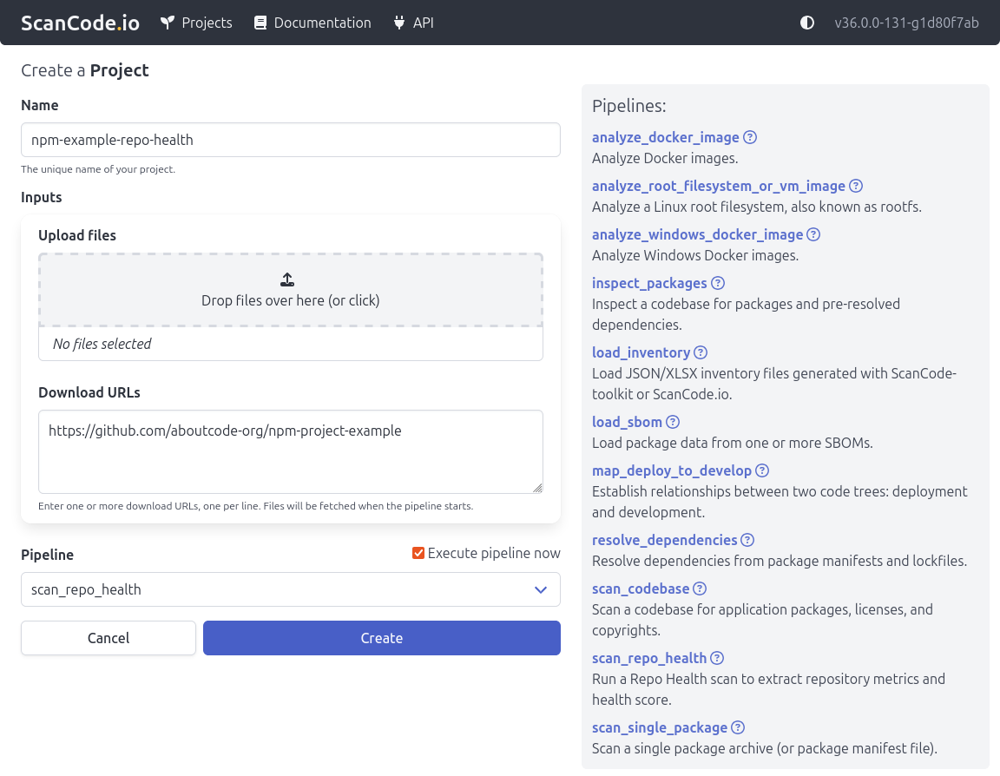
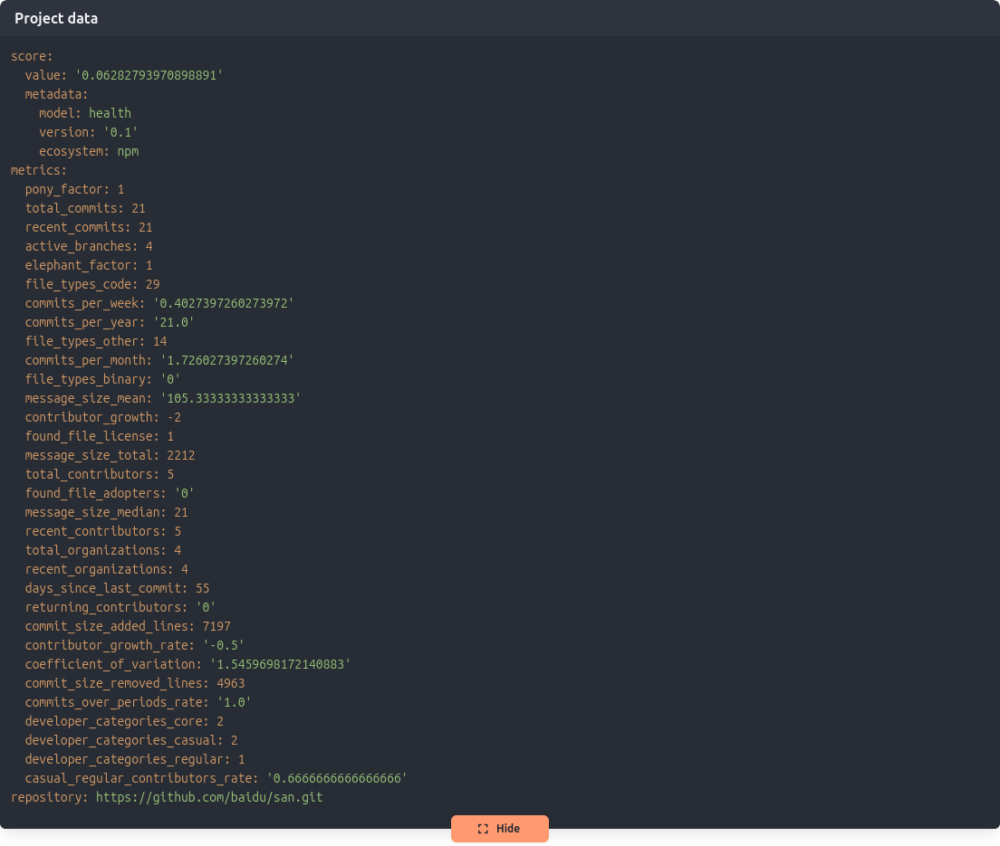

.. _tutorial_web_ui_scan_repo_health:

Scan repo health (Web UI)
=========================

This tutorial guides you through scanning the health
of a git repository using the ScanCode.io Web UI.

.. note::
    This tutorial assumes you have a recent version of ScanCode.io installed
    locally on your machine and **running with Docker**.
    If you do not have it installed, see our :ref:`installation` guide for instructions.

Requirements
------------

Before you follow the instructions in this tutorial, you need to:

- Install **ScanCode.io** locally.
- Access to the web application from your preferred browser on http://localhost/ or
  http://localhost:8001/ if you run on a local development setup.
- Make sure the following GrimoireLab
  service is correctly configured: :ref:`scancodeio_settings_grimoirelab`.

Instructions
------------

1. From the homepage, click the ``New Project`` button.
2. Enter ``npm-example-repo-health`` as the project **Name** for example.
3. Add a valid git repository url into the **Download URL** field:
   https://github.com/aboutcode-org/npm-project-example
4. Select ``scan_repo_health`` from the **Pipeline** dropdown.
5. Check the **Execute pipeline now** box to run the pipeline immediately upon creation.
6. Click **Create**.

7. Once the pipeline execution is complete, you can download the generated output result in
   **JSON** format (for example, ``metrics-2026-09-10-12-02-38.json``)
   or directly view the data from the project's result view.

