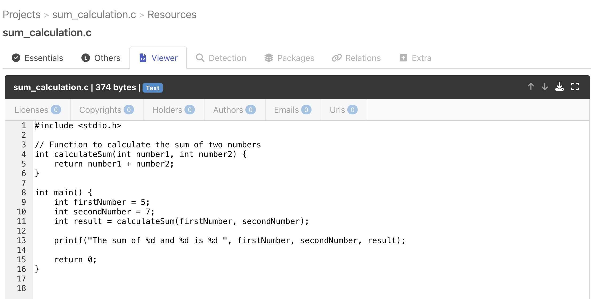
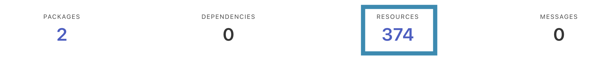
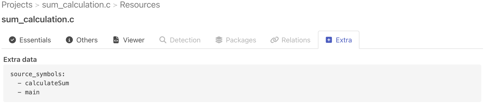
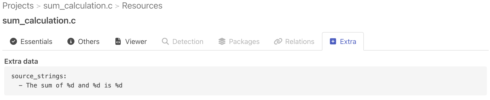
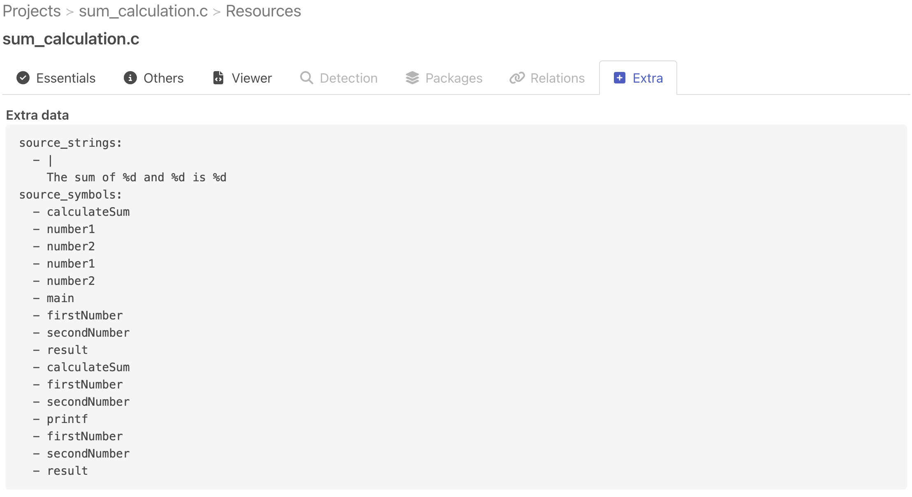
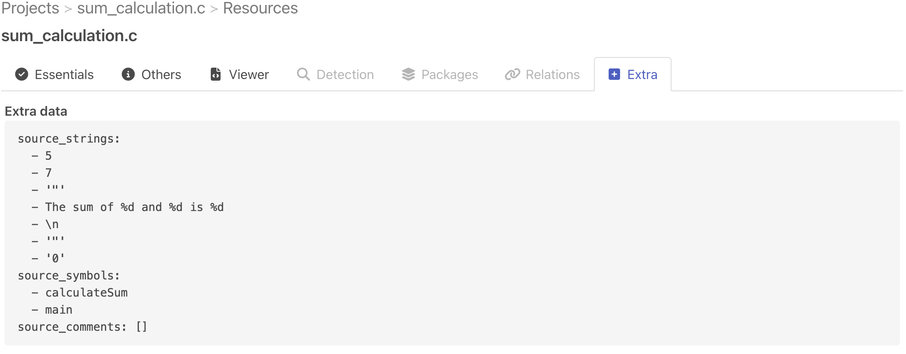

.. _tutorial_web_ui_symbol_and_string_collection:

Symbol and String Collection (Web UI)
=====================================

In this tutorial we'll introduce the different addon pipeline that can be used for
collecting symbols and strings from codebase resources.

.. note::
    This tutorial assumes that you have a working installation of ScanCode.io.
    If you don't, please refer to the :ref:`installation` page.

Throughout this tutorial, we will use this resource for symbol and string collection.

Ctags Symbols
-------------

- Open any existing projects containing a few resources.

- Click on the **"Add pipeline"** button and select the **"collect_symbols_ctags"**
  pipeline from the dropdown list.
  Check the **"Execute pipeline now"** option and validate with the **"Add pipeline"**
  button.

.. warning::
    The ``collect_symbols_ctags`` pipeline requires ``universal-ctags``, please refer
    to the :ref:`system_dependencies`.

- Once the pipeline run completes with success, you can reach the **Resources** list view
  by clicking the count number under the **"RESOURCES"** header:

- Click on any code file and go to **Extra** tab, to get the resource symbols.

Xgettext Strings
----------------

- Open any existing projects containing a few resources.

- Click on the **"Add pipeline"** button and select the **"collect_strings_gettext"**
  pipeline from the dropdown list.
  Check the **"Execute pipeline now"** option and validate with the **"Add pipeline"**
  button.

.. warning::
    The ``collect_strings_gettext`` pipeline requires ``gettext``, please refer
    to the :ref:`system_dependencies`.

- Once the pipeline run completes with success, you can reach the **Resources** list view
  by clicking the count number under the **"RESOURCES"** header:

- Click on any code file and go to **Extra** tab, to get the resource strings.

Tree-Sitter Symbols and Strings
-------------------------------

- Open any existing projects containing a few resources.

- Click on the **"Add pipeline"** button and select the **"collect_symbols_tree_sitter"**
  pipeline from the dropdown list.
  Check the **"Execute pipeline now"** option and validate with the **"Add pipeline"**
  button.

- Once the pipeline run completes with success, you can reach the **Resources** list view
  by clicking the count number under the **"RESOURCES"** header:

- Click on any code file and go to **Extra** tab, to get the resource symbols and strings.

Pygments Symbols and Strings
-------------------------------

- Open any existing projects containing a few resources.

- Click on the **"Add pipeline"** button and select the **"collect_symbols_pygments"**
  pipeline from the dropdown list.
  Check the **"Execute pipeline now"** option and validate with the **"Add pipeline"**
  button.

- Once the pipeline run completes with success, you can reach the **Resources** list view
  by clicking the count number under the **"RESOURCES"** header:

- Click on any code file and go to **Extra** tab, to get the resource symbols and strings.

