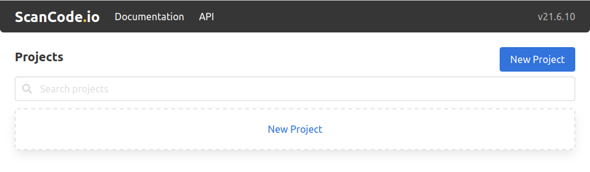
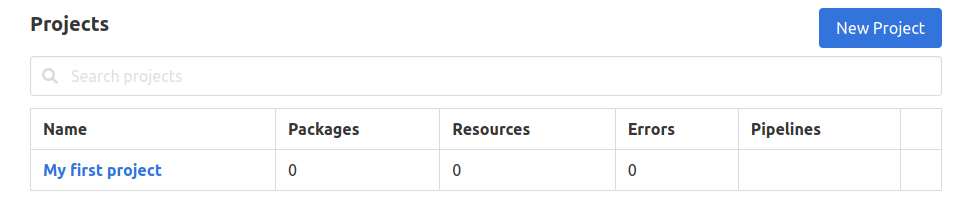
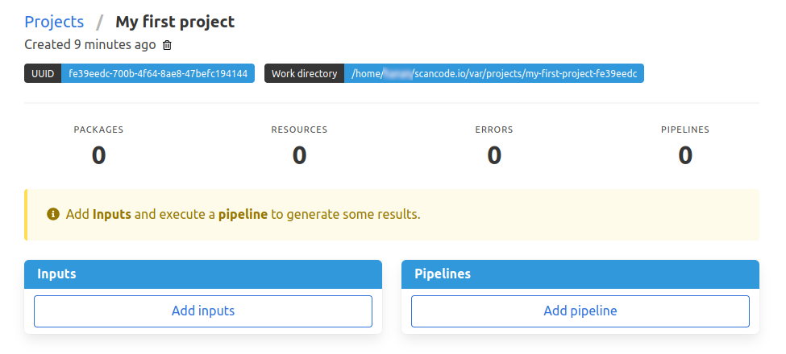
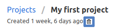
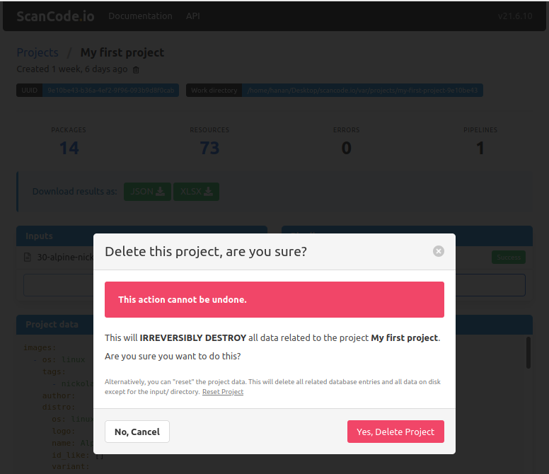

.. _user_interface:

User Interface
==============

As mentioned in the installation guide, ScanCode.io offers a web application to
create and manage your projects from a browser. You’ll get access to this
visual interface when you successfully install ScanCode.io locally.

You can start the local web server and access the app with::

    make run

To access the web application, open your web browser and visit: http://127.0.0.1:8001/

.. note::
    All the capabilities offered by the ScanCode.io Web Interface are also available as
    :ref:`command_line_interface` and in the :ref:`rest_api`.

Home Screen
-----------

When you open the web application for the first
time, the home screen will appear. From this screen, you'll be able to
create a new project, search your existing projects, view or download scan
results, access documentation, and more.

.. _user_interface_create_new_project:

Creating a New Project
----------------------

Creating a project is the first step that needs to be performed before you
can start using ScanCode.io. There are two **"New Project"** buttons on the
home screen, as shown in the previous screenshot. To create a new project,
click on either button, and you will be directed to the **"Create a Project"**
page.

.. image:: images/user-interface-2.png

As shown above, creating a project involves filling in the following input
fields:

Name
^^^^

To create a project, you must provide a unique name for the new project.

.. warning::
    A project name can't be changed or edited once the project has been created.

Inputs
^^^^^^

You can upload files available on your machine or add links to desired input files,
such as package archives or Docker images, as the input to your project.
If you are providing more than one URL as the project input, make sure to add one URL
per line.

.. tip::
    Docker images can be provided as inputs to be fetched using the
    ``docker://docker-reference`` syntax in the **"Download URLs"** field.
    For example: ``docker://postgres:13``

Pipeline
^^^^^^^^

Use the drop-down list to select one of the available pipelines depending on
your use-case. When you add a pipeline, you can check the
**"Execute pipeline now"** checkbox, which will add and execute the selected
pipeline in one operation.

.. note::
    If you're not sure of which pipeline to select, refer to the
    pipelines details on the right pane of the **"Create a Project"** page,
    as shown above.

You can still create a new project while leaving the **Inputs** and **Pipeline**
fields blank; however, it's mandatory to provide a project **Name**!

Once successfully created, you can later add any needed inputs and pipelines
to your project by clicking the **"Add inputs"** and **"Add pipeline"** buttons.

.. warning::
    You will not be able to add any extra inputs once a pipeline has been run on
    the project. However, you still can add and run extra pipelines as needed!

Within each project, you can view your project details, review the results of
the pipeline execution, or download the output files.

.. note::
    Please refer to the :ref:`output_files` page for more details about your
    scan results.

Deleting a Project
------------------

If any of your projects is no longer needed, you can delete it from the
project's details page. Deleting old projects also makes navigating existing
projects easier. Simply to delete any project, click on the trash icon under
the project's name.

.. warning::
    Projects get permanently deleted and cannot be restored.

