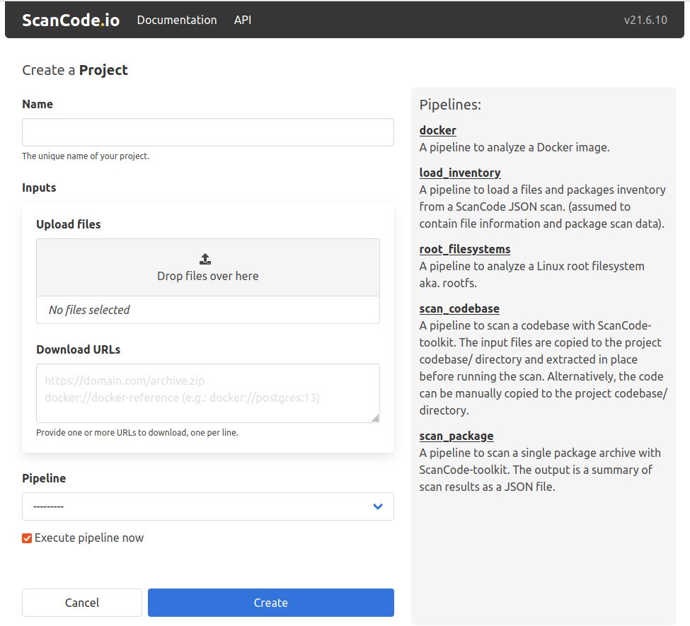
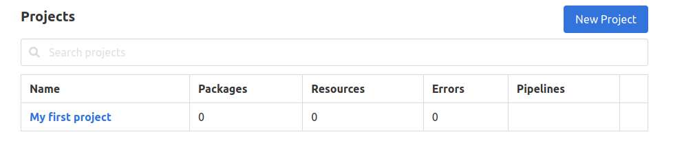
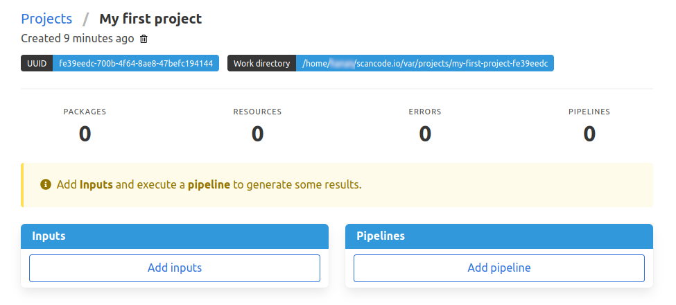
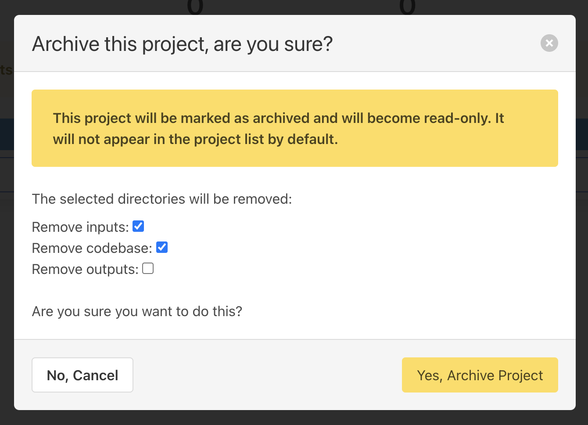
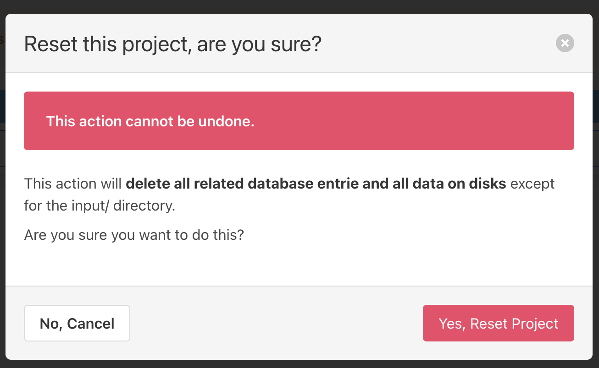
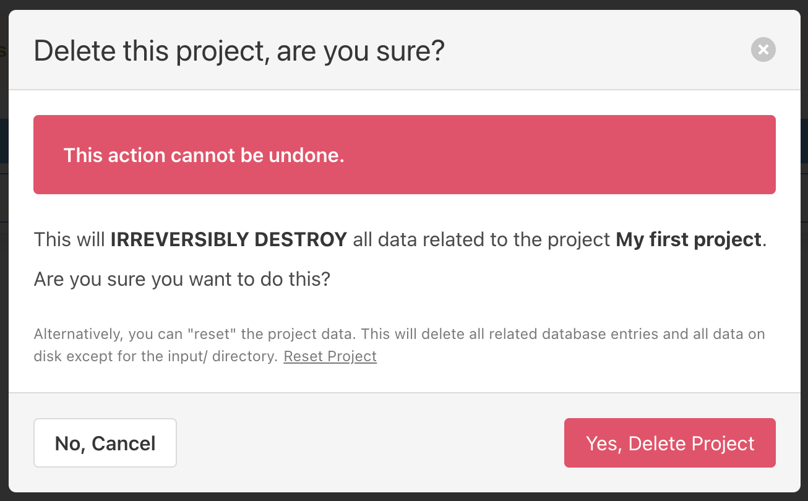

.. _user_interface:

User Interface
==============

As mentioned in the installation guide, ScanCode.io offers a web application to
create and manage your projects from a browser. You’ll get access to this
visual interface when you successfully install ScanCode.io locally.

To access the web application, open your web browser and visit http://localhost/ or
http://localhost:8001/ if you run on a local development setup.

.. note::
    All the capabilities offered by the ScanCode.io Web Interface are also available as
    :ref:`command_line_interface` and in the :ref:`rest_api`.

Home Screen
-----------

When you open the web application for the first
time, the home screen will appear. From this screen, you'll be able to
create a new project, search your existing projects, view or download scan
results, access documentation, and more.

.. image:: images/user-interface-project-list-empty.png

.. _user_interface_create_new_project:

Creating a New Project
----------------------

Creating a project is the first step that needs to be performed before you
can start using ScanCode.io. There are two **"New Project"** buttons on the
home screen, as shown in the previous screenshot. To create a new project,
click on either button, and you will be directed to the **"Create a Project"**
page.

As shown above, creating a project involves filling in the following input
fields:

Name
^^^^

To create a project, you must provide a unique name for the new project.

.. warning::
    A project name can't be changed or edited once the project has been created.

Inputs
^^^^^^

You can upload files available on your machine or add links to desired input files,
such as package archives or Docker images, as the input to your project.
If you are providing more than one URL as the project input, make sure to add one URL
per line.

.. tip::
    Docker images can be provided as inputs to be fetched using the
    ``docker://docker-reference`` syntax in the **"Download URLs"** field.
    For example: ``docker://postgres:13``

Pipeline
^^^^^^^^

Use the drop-down list to select one of the available pipelines depending on
your use-case. When you add a pipeline, you can check the
**"Execute pipeline now"** checkbox, which will add and execute the selected
pipeline in one operation.

.. note::
    If you're not sure of which pipeline to select, refer to the
    pipelines details on the right pane of the **"Create a Project"** page,
    as shown above.

You can still create a new project while leaving the **Inputs** and **Pipeline**
fields blank; however, it's mandatory to provide a project **Name**!

Once successfully created, you can later add any needed inputs and pipelines
to your project by clicking the **"Add inputs"** and **"Add pipeline"** buttons.

.. warning::
    You will not be able to add any extra inputs once a pipeline has been run on
    the project. However, you still can add and run extra pipelines as needed!

Within each project, you can view your project details, review the results of
the pipeline execution, or download the output files.

.. note::
    Please refer to the :ref:`output_files` page for more details about your
    scan results.

.. _user_interface_project_settings:

Project Settings
----------------

The project settings form provides a convenient interface for editing essential project
details and adding relevant notes. With this form, you have the ability to modify the
project name, as well as include any additional notes you deem necessary.

In addition to managing project information, the form also offers configuration options
that are related to the extraction process.
You can specify a list of items to be ignored during pipeline execution,
ensuring that only relevant content is considered.
Furthermore, you have the option to customize the attribution template according to
your specific requirements.

.. tip::
    To generate the project configuration file ``scancode-config.yml``, navigate to the
    Project Settings UI and click on the **Config file** link in the left section under
    **Download**.

.. _user_interface_manage_webhook:

Manage Webhook
^^^^^^^^^^^^^^

The **Manage Webhook** section in the Project Settings view allows you to configure
Webhook subscriptions for project pipeline execution events.

From the Settings page, you can:

- **Add a new webhook** by specifying a target URL that will receive event notifications.
- **Edit an existing webhook** to update its target URL, event triggers, or payload settings.
- **Delete a webhook** to stop receiving notifications for that project.

Each webhook is associated with a **WebhookSubscription** and includes the following
configurable options:

- **Target URL**: The destination where the webhook payload will be sent when triggered.
- **Trigger on Each Run**: Choose whether to send notifications after each pipeline run
  or only after all runs are completed.
- **Include Summary**: Decide whether to include summary data in the webhook payload.
- **Include Results**: Optionally include detailed scan results in the webhook payload.
- **Active Status**: Enable or disable the webhook without deleting it.

.. note::
    Ensure the target URL is correctly configured to receive webhook requests and
    process them accordingly.

Archive a Project
^^^^^^^^^^^^^^^^^

After a project is complete, you may want to archive it to prevent any further
modification to that project.

Archiving projects also makes navigating existing projects easier as the archived
projects are hidden by default from the project list.

Selected :ref:`project_workspace` directories can be removed during the archive
operation.

.. tip::
    The project results are stored in the database and available to generate outputs
    at any time.

.. note::
    A project cannot be archived if one of its related run is queued or already running.

Reset a Project
^^^^^^^^^^^^^^^

The reset allows to **wipe all database entries and all data on disks** related to a
project while keeping the :guilabel:`input/` files.
It can be used to re-run pipelines on a clean slate of the project without having to
re-upload input files.

Delete a Project
^^^^^^^^^^^^^^^^

If any of your projects is no longer needed, you can delete it from the
project's details page. Deleting old projects also makes navigating existing
projects easier. Simply to delete any project, click on the trash icon under
the project's name.

.. warning::
    Projects get permanently deleted and cannot be restored.

Search Syntax
-------------

When searching on objects list views, you can use a powerful search syntax to refine
your queries and find exactly what you're looking for.
This guide will walk you through the search syntax and provide examples to help you
get started.

Basic Search
^^^^^^^^^^^^

- **Single Term**: Enter a single word to search for exact matches.

  Example: ``file.txt``

- **Quoted Phrases**: Use double quotes to search for exact phrases.

  Example: ``"name version"``

Advanced Search
^^^^^^^^^^^^^^^

- **Field Searches**: Specify fields to narrow down your search.
  Use ``field_name:`` followed by your search term.

  Example: ``name:file.txt``

- **Negation**: Use a hyphen (-) before a field name to exclude results.

  Example: ``-name:file.txt``

- **Lookup Types**: Use lookup types to perform specific searches.

    - ``=``: Exact match
    - ``^``: Starts with
    - ``$``: Ends with
    - ``~``: Contains
    - ``>``: Greater than
    - ``<``: Less than

Example: ``path^:dir1``

Combining Queries
^^^^^^^^^^^^^^^^^

Multiple queries are combined with the ``AND`` operator:

Example: ``name:file.txt status:scanned``

Examples
^^^^^^^^

Here are some examples of advanced searches:

**Search for Resources**:

 - Find resources by name and license_expression:
   ``name:LICENSE detected_license_expression:mit``
 - Find resources by path ending:
   ``path$:directory_without_slash``
